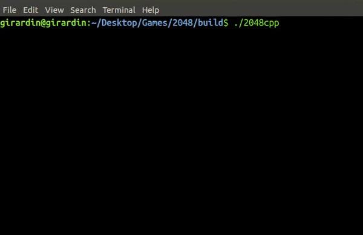

# 2048.cpp
[](https://www.codacy.com/manual/mgirardin/2048.cpp?utm_source=github.com&amp;utm_medium=referral&amp;utm_content=mgirardin/2048.cpp&amp;utm_campaign=Badge_Grade)
[](https://lgtm.com/projects/g/mgirardin/2048.cpp/alerts/)
[](https://lgtm.com/projects/g/mgirardin/2048.cpp/context:cpp)

Fully configurable CLI version of the game 2048


## Demo



## Setup

### Requirements

* C++11 compiler (e.g. `g++`)
* Unix environment (for now)
* CMake

### Build

1. Clone this project
```sh
git clone https://github.com/mgirardin/2048.cpp.git
```
2. Enter the project's build directory (or create one):
```sh
cd 2048.cpp/build
```
3. Generate Makefile 
```sh
cmake ..
```
4. Build
```sh
make
```
5. Run the program
```sh
./2048cpp
```
